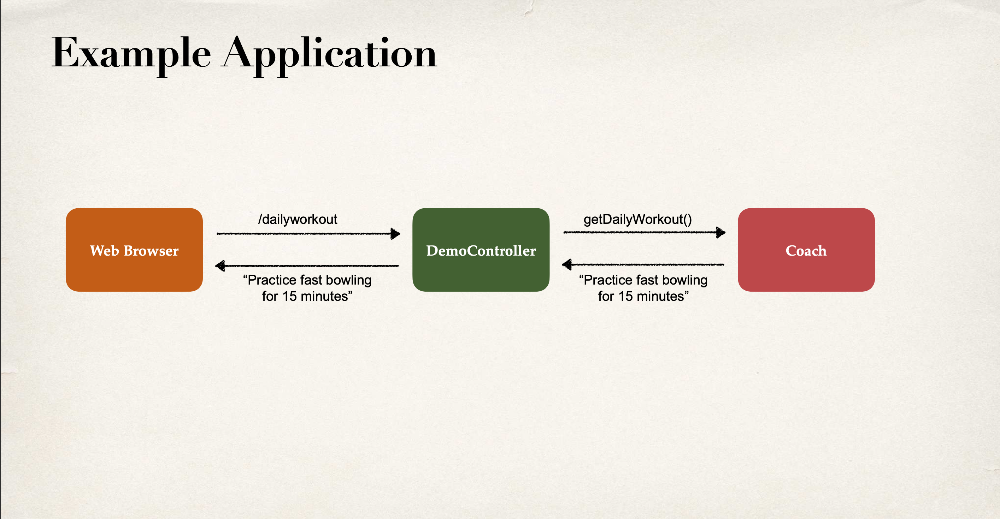
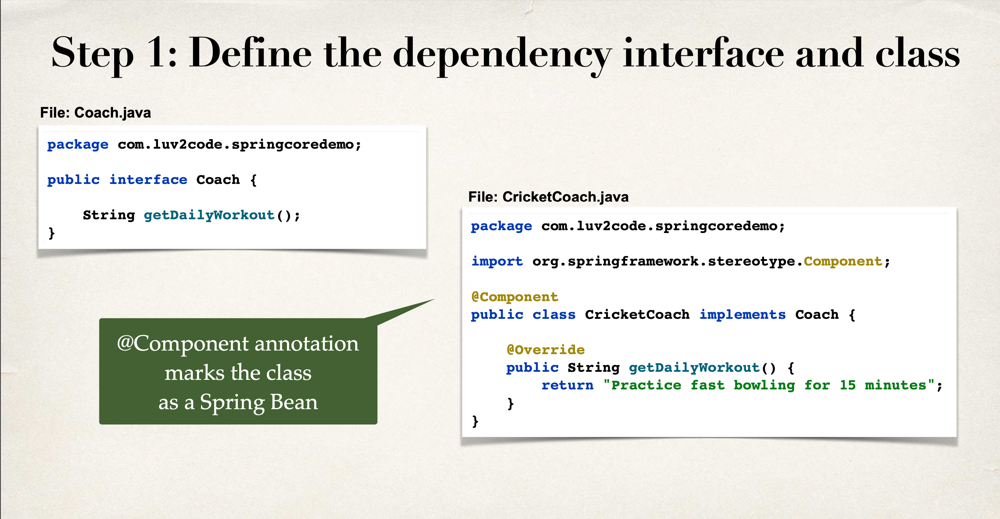
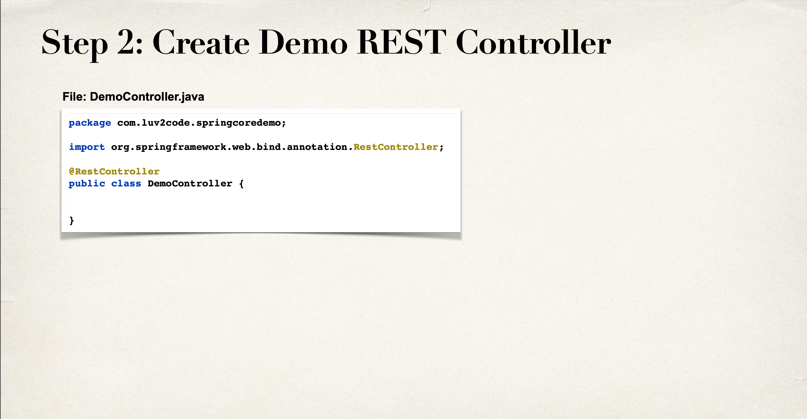
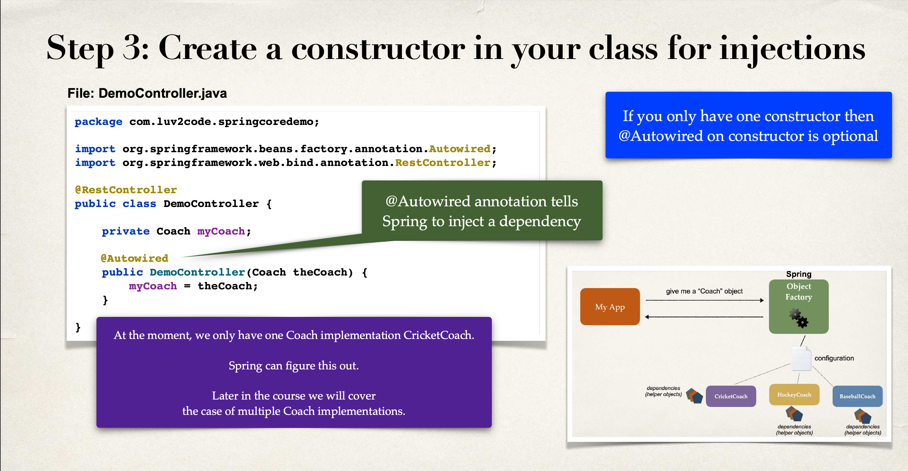
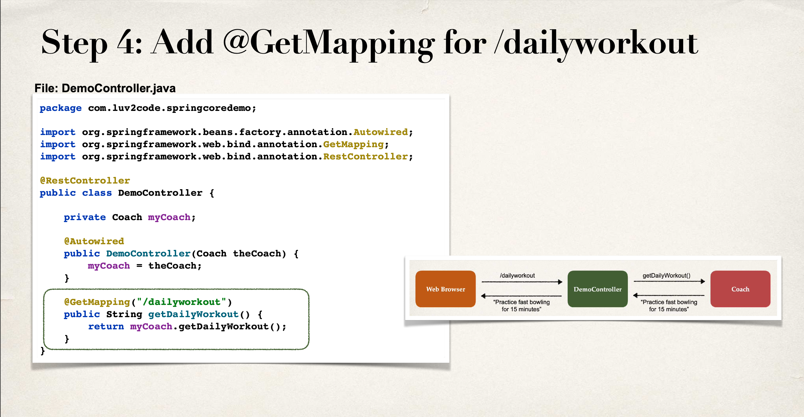
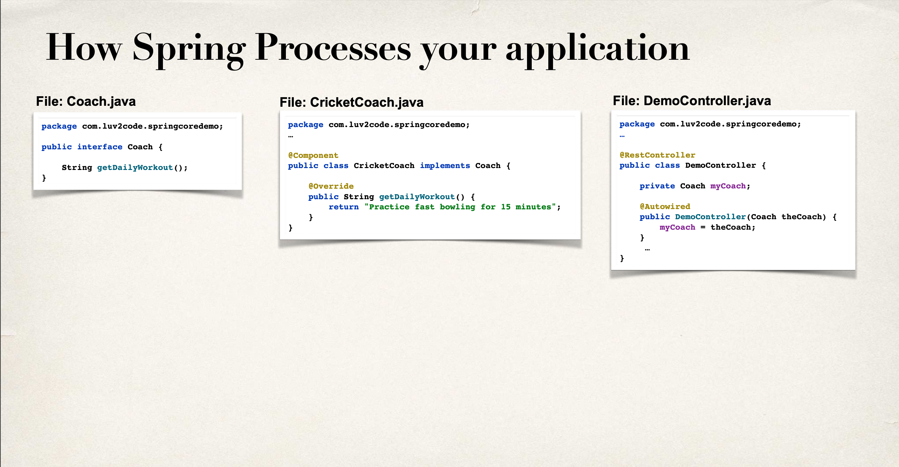
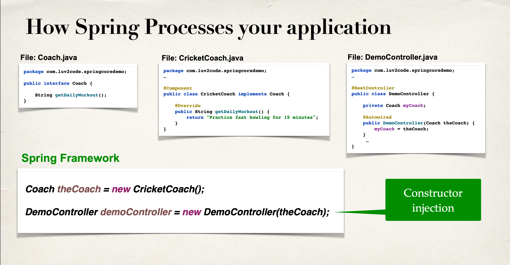

# Spring Core - Constructor Injection Demo

# Topics Covered

# Dependency Injection
* The dependency inversion principle.
* The client delegates to another object
the responsibility of providing its
dependencies.

# Spring Container
* Primary functions
  * Create and manage objects (Inversion of Control)
  * Inject object’s dependencies (Dependency Injection)

# Demo Example (Imlementation Overview)
* Coach will provide daily workouts
* The DemoController wants to use a Coach
  * New helper: Coach
  * This is a dependency
* Need to inject this dependency

# Injection Types
* There are multiple types of injection with Spring

* We will cover the two recommended types of injection
  * Constructor Injection
  * Setter Injection

# Injection Types - Which one to use?
* Constructor Injection
  * Use this when you have required dependencies
  * Generally recommended by the spring.io development team as first choice

* Setter Injection
  * Use this when you have optional dependencies
  * If dependency is not provided, your app can provide reasonable default logic

# What is Spring AutoWiring?
* For dependency injection, Spring can use autowiring
* Spring will look for a class that matches
  * <em>matches</em> by type: class or interface
* Spring will inject it automatically … hence it is autowired

# Autowiring Example
* Injecting a Coach implementation
* Spring will scan for @Components
* Any one implements the Coach interface???
* If so, let’s inject them. For example: <em>CricketCoach</em>

# Development Process - Constructor Injection (Step by Step)
1. Define the dependency interface and class
2. Create Demo REST Controller
3. Create a constructor in your class for injections
4. Add @GetMapping for /dailyworkout

# @Component annotation
* @Component marks the class as a Spring Bean
  * A Spring Bean is just a regular Java class that is managed by Spring
* @Component also makes the bean available for dependency injection

# Constructor Injection Behind the Scenes

